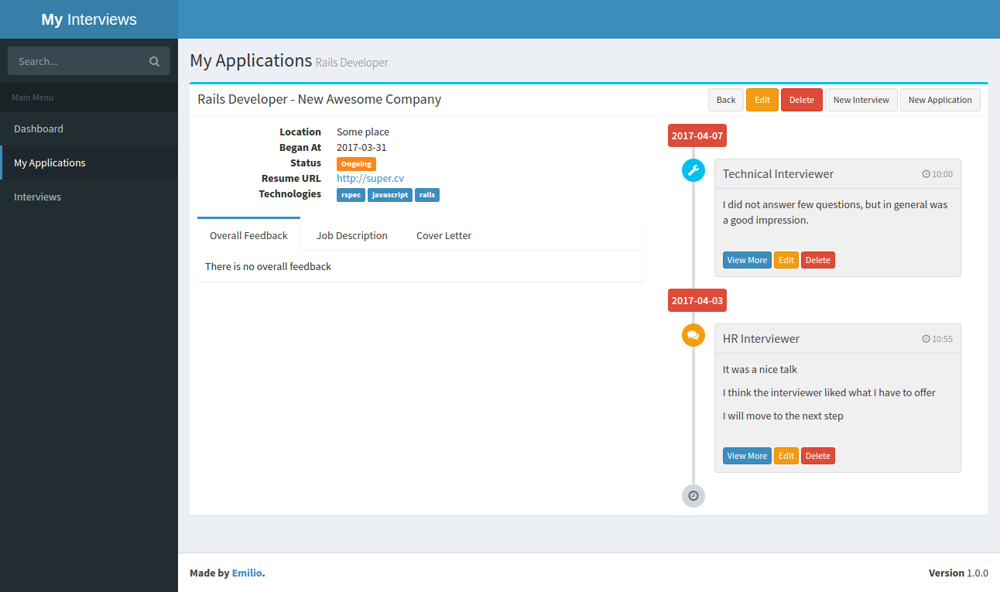

myinterviews
=============
[](https://travis-ci.org/emilio2hd/myinterviews)
[](https://codebeat.co/projects/github-com-emilio2hd-myinterviews-master)

The goal of this app is to manage applications, interviews, and feedbacks.
 

 
# Docker
You can run the application using Docker.

The container has the port **3000** exposed.

The application does not contains a database, so you must inform the data base info by environment variables

### Build container

To build an image of the application, execute:
```
docker build -t myinterviews .
```

### Environment Variables

* **APP_DB_HOST** - The database host address
* **APP_DB_PORT** - The database port
* **APP_DB_USER** - The database username
* **APP_DB_PASSWORD** - The database password
* **SECRET_KEY_BASE** - The secret key is required to run in production mode

### Docker-compose
Here is an example of a docker-compose.yml file:

```yml
db:
  image: postgres:9.4
  container_name: myinterviews-db
  ports:
    - "5432:5432"
  environment:
    - POSTGRES_USER=db_user
    - POSTGRES_PASSWORD=123456
    - POSTGRES_DB=myinterviews
web:
  container_name: myinterviews-web
  build: .
  ports:
    - "3000:3000"
  environment:
    - APP_DB_HOST=db
    - APP_DB_PORT=5432
    - APP_DB_USER=db_user
    - APP_DB_PASSWORD=123456
    - SECRET_KEY_BASE=ef8705c8be8bc5c562fd403847e1451d8e149ba4bf88dea34c7e0c99fc55556d3ea3e0619b24ff7399f19c3c0e7798b62ffe643e8a6911cee982e7143ef0e262
  links:
    - db
```

# Contributions
If you want contribute, send me a pull request. ;)